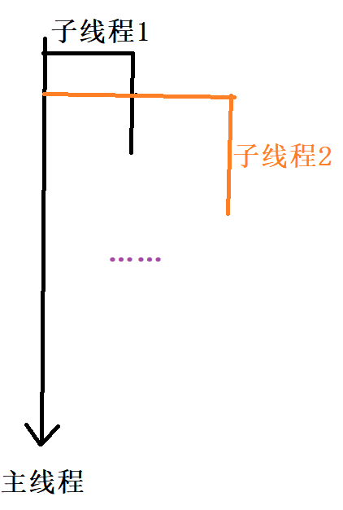

# 第一阶段


# 第二阶段

拼接url

```C++
// 发送请求
QUrl url = QUrl("https://aip.baidubce.com/oauth/2.0/token");
// 拼接键值对
QUrlQuery query;
query.addQueryItem("grant_type", "client_credentials");
query.addQueryItem("client_id", "AuS0kkIHTNNTzggpY20SYzgf");
query.addQueryItem("client_secret", "EQnDZ9o8eGWxWrS7wlMztzton3ZmVFM1");

// 将拼接好的网址对url进行重新赋值
url.setQuery(query);
qDebug() << url;
```

需要两个动态库进行https的支持

检测是否可以支持ssl

先锋协议：`QueryPeer`对等查询

```C++
///////////////////////配置ssl//////////////////////////
// 对ssl配置进行默认初始化
ssl_configuration = QSslConfiguration::defaultConfiguration();
// 设置ssl的对等验证模式为 QueryPeer
ssl_configuration.setPeerVerifyMode(QSslSocket::QueryPeer);
ssl_configuration.setProtocol(QSsl::TlsV1_2);
```

组装请求

```C++
// 组装请求
QNetworkRequest req;
req.setUrl(url);
req.setSslConfiguration(ssl_configuration);

// 使用get方法发送请求
token_manager->get(req);
// 接受服务器传过来的信号，进行处理
connect(token_manager, &QNetworkAccessManager::finished, this, &Recognition::TokenReply);
```

槽函数的实现

解析`JSON`

```C++
// 用于接受服务器返回的finish信号
void Recognition::TokenReply(QNetworkReply *reply)
{
    // 错误处理
    if (reply->error() != QNetworkReply::NoError)
    {
        qDebug() << reply->errorString();
        return;
    }
    // 正常应答
    const QByteArray reply_data = reply->readAll();
//    qDebug() << reply_data;
    // JSON转换
    QJsonParseError json_err;
    // 将成功解析到的JSON内容存到 json_doc 内
    QJsonDocument json_doc = QJsonDocument::fromJson(reply_data, &json_err);

    // 解析错误
    if (json_err.error != QJsonParseError::NoError)
    {
        qDebug() << "JSON ERR: " << json_err.errorString();
    }
    // 正常解析
    // 拿去json对象
    QJsonObject json_obj = json_doc.object();
    // 如果json对象包含 key access_token 的话，进行后续操作
    if (json_obj.contains("access_token"))
    {
        // 将json对象的内容利用take取出来，将字符串保存到 access_token 内
        access_token = json_obj.take("access_token").toString();
    }

    // 将解析到的json文本放入到textBrowser中进行显示
    ui->textBrowser->setText(access_token);
}
```


# 第三阶段

## 访问百度接口

`QJsonDocument`的作用是将`JSON对象`转换成`JSON字符串`，或者将`JSON字符串`转换为`JSON对象

> 提问？
>
> 从服务器拿取到QJsonObject之后通过QJsonDocument转换为QString进行处理，对不对，还有就是从客户端向服务器发送请求是从QString通过QJsonDocument转换为QJsonObject对不对


> 回答：
>
> 你的理解基本正确，但在处理JSON数据时，你通常是在服务器和客户端之间发送和接收JSON格式的字符串（即`QString`），然后使用Qt的JSON处理类（如`QJsonDocument`和`QJsonObject`）来解析或生成这些字符串。
>
> 下面是你的理解的概括：
>
> ### 服务器端：
>
> 1. **接收JSON字符串**：服务器从客户端接收一个JSON格式的字符串（`QString`）。
> 2. **解析JSON字符串**：使用`QJsonDocument::fromJson(jsonString)`方法将JSON字符串转换为`QJsonDocument`对象。
> 3. **获取QJsonObject**：如果JSON字符串表示一个对象，则可以通过`QJsonDocument::object()`方法获取`QJsonObject`。
> 4. **处理QJsonObject**：对`QJsonObject`进行你需要的操作，如读取值、修改值等。
>
> ### 客户端：
>
> 1. **创建QJsonObject**：在客户端创建一个`QJsonObject`对象，并填充你需要的键值对。
> 2. **转换为QJsonDocument**：使用`QJsonDocument(jsonObject)`构造函数或`QJsonDocument::fromJsonObject(jsonObject)`静态方法将`QJsonObject`转换为`QJsonDocument`。
> 3. **转换为JSON字符串**：使用`QJsonDocument::toJson()`方法将`QJsonDocument`对象转换回JSON格式的字符串（`QByteArray`），然后可以将其转换为`QString`（如`QString::fromUtf8(byteArray)`）。
> 4. **发送JSON字符串**：将JSON字符串发送到服务器。
>
> 所以，你的理解是正确的：
>
> * 从服务器拿取到`QJsonObject`之后，通常是通过`QJsonDocument`转换为`QString`（实际上是先转换为`QByteArray`，然后转换为`QString`）进行处理或显示。
> * 从客户端向服务器发送请求时，是从`QString`（或`QByteArray`）通过`QJsonDocument`转换为`QJsonObject`（或直接使用`QJsonObject`创建JSON对象），然后再转换为JSON字符串进行发送。


总结：

调起摄像头，利用定时器不断刷新画面，进行拍照，之后进行显示


# 第四阶段

解决点击拍照之后，前台ui显示卡顿的问题，利用子线程进行实现


# 第五阶段

- 增加切换摄像头的功能
- 并且将人脸信息输出到画面上
- 优化线程

优化线程步骤

```C++
if (childThread->isFinished())
{
    qDebug() << "子线程结束";
} else {
    qDebug() << "子线程运行中";
}
```

进行判断，发现

```C++
……
子线程运行中
qt.network.ssl: QSslSocket: cannot call unresolved function SSL_set_psk_use_session_callback
子线程运行中
qt.network.ssl: QSslSocket: cannot call unresolved function SSL_set_psk_use_session_callback
ImageReply reply data is ……
子线程运行中
ImageReply reply data is ……
子线程运行中
ImageReply reply data is ……
子线程运行中

子线程一直在运行中
```

解决方案：
在杀掉子进程之后，要进行等待，即保证杀掉子进程之后才继续往下运行
`childThread->wait(); `

输出如下：

```C++
……
子线程结束
qt.network.ssl: QSslSocket: cannot call unresolved function SSL_set_psk_use_session_callback
子线程结束
qt.network.ssl: QSslSocket: cannot call unresolved function SSL_set_psk_use_session_callback
ImageReply reply data is ……
ImageReply reply data is ……
子线程结束
子线程结束
子线程结束
qt.network.ssl: QSslSocket: cannot call unresolved function SSL_set_psk_use_session_callback
ImageReply reply data is ……
子线程结束
子线程结束
```

优化：

> - 利用定时器发送人脸识别请求，避免串行出现问题
>
>   - 在利用定时器发送请求的时候，会出现以下问题
>   - 
>   - 在不断的创建子线程之后，而又关闭不掉的情况下，程序会出现问题
>
> - 解决方案：
>
> - 修改给工人发送信号的参数
>
>   - ​	
>
>   - 《图像识别类内》
>
>   - ```c++
>     void beginWork(QImage, QThread*);   // 将信号传给“工人”，让工人开始拼接 post 请求数据，并传入当前子线程
>     ```
>
>   - ```C++
>     void BeginFaceDetect(QByteArray post_data, QThread*);  // 开启人脸识别
>     ```
>
>   - 《工人类内》
>
>   - ```C++
>     public slots:
>         void DoWork(QImage, QThread*);
>     
>     signals:
>         void resultReady(QByteArray, QThread*);
>     ```
>
>   - 即当开启子线程的时候，将该线程送入给工人，工人完成当前工作之后，将子线程进行返回，可以有效识别当前是那个线程，避免程序出现卡顿的问题
